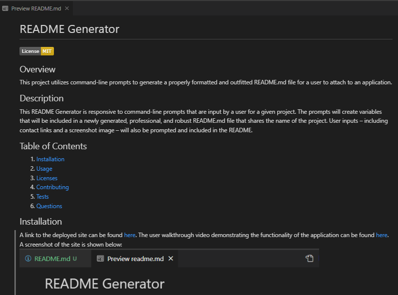

# README Generator

## Overview
This project utilizes command-line prompts to generate a properly formatted and outfitted README.md file for a user to attach to an application.

## Description
This README Generator is responsive to command-line prompts that are input by a user for a given project. The prompts will create variables that will be included in a newly generated, professional, and robust README.md file that shares the name of the project. User inputs – including contact links and a screenshot image – will also be prompted and included in the README.

## Table of Contents

1. [Installation](#installation)
2. [Usage](#usage)
3. [Licenses](#licenses)
4. [Contributing](#contributing)
5. [Tests](#tests)
6. [Questions](#questions)

## Installation
A link to the deployed site can be found [here](https://kristensantee.github.io/professional-portfolio-challenge/). The user walkthrough video demonstrating the functionality of the application can be found [here](https://drive.google.com/file/d/16WHNQa12Z4Zhi6fYIRMwoHGeqtXFivVl/view). A screenshot of the site is shown below: 
.

## Usage
To use this project, access the command line and invoke the command “node index.js” to start the prompt chain. Please note you will need to provide links for the deployed site, your github profile, your LinkedIn profile, your email, and the relative link for the app screenshot you want to include in the README. You will also need to select the license to include with the project. 

## Licenses
This project uses the MIT license. More info about licenses can be found [here](https://choosealicense.com/).

## Contributing
This project is open for contribution but please initiate an issue for any significant changes. 

## Tests
There are no testing instructions at this time.

## Questions
The developer can be reached through [email](kristen@mail.com) or contacted through [Github](https://github.com/kristensantee) or [LinkedIn](https://www.linkedin.com/in/kristen-santee-aba1a631/)

